# System Architecture: Co-Hosted T-Pot CE Deployment

This document outlines the architecture of the T-Pot CE honeypot deployment, specifically designed for **co-hosting** alongside other web services on a single Oracle Cloud Infrastructure (OCI) Ubuntu ARM server. This setup utilizes Cloudflare for edge security and DNS, with a host-level System Nginx instance acting as the primary traffic director and reverse proxy.

## Core Components

1.  **OCI Ubuntu Host:** The underlying ARM-based virtual machine running Ubuntu, hosting all services : aka. '(`[REDACTED_HOSTNAME]`)'
2.  **Cloudflare:** Provides DNS, CDN, DDoS protection, and WAF capabilities. It acts as the initial entry point for web traffic destined for public domains (Ports 80/443). SSL/TLS mode is set to "Full (strict)", requiring valid origin certificates. 
    ##### *Note: If attackers discover the server's actual IP address, they can bypass all Cloudflare security protections by connecting directly to the IP, potentially exposing the server to attacks that would otherwise be blocked. However, this architecture is designed to route such direct IP access to honeypot services rather than production websites.*
3.  **Cloudflare Tunnel (`cloudflared`):** A specific tunnel service running on the host, securely connecting the host to the Cloudflare edge without exposing public ports (other than those needed for honeypots/admin). It forwards traffic for `honeypot.tarek.ai` to the System Nginx listening internally on `127.0.0.1:[CF_TUNNEL_TARGET_PORT]`.
4.  **System Nginx:** The main Nginx instance installed directly on the host (`/etc/nginx/`). Crucial for traffic routing:
    *   **Listens Externally:** On ports 80 and 443 for traffic hitting the server's public IP directly, and on specific honeypot ports (e.g., 9100, 9200, 631, 6379, 5555) intended for direct honeypot interaction (proxied internally).
    *   **Listens Internally:** On `127.0.0.1:[CF_TUNNEL_TARGET_PORT]` to receive traffic specifically for `honeypot.tarek.ai` from the Cloudflare Tunnel.
    *   **Virtual Hosts:** Routes traffic for known domains (`tarek.ai`, `cbsworcester.com`) to their webroots. The configuration for `honeypot.tarek.ai` proxies map/websocket traffic to the internal T-Pot map service.
    *   **Default Server (`main.conf`):** Catches traffic hitting the server IP directly on ports 80/443 or for unknown hostnames. Proxies HTTP to Snare (`127.0.0.1:[SNARE_INTERNAL_PORT]`) and HTTPS to H0neytr4p (`127.0.0.1:8043`). Also proxies specific external ports (e.g., 9100) to internal honeypot containers (e.g., Miniprint on `127.0.0.1:9101`), ensuring client IP headers are passed.
5.  **Docker & T-Pot CE:** The honeypot suite runs within Docker containers managed via `docker-compose` and Portainer.
    *   **Directly Exposed Honeypots:** Key honeypots (Cowrie, Heralding, Mailoney, etc.) bind directly to standard ports (22, 23, 25, 3389, etc.) on the host network interface (`0.0.0.0:<port>`), receiving traffic allowed by the OCI firewall.
    *   **Internally Exposed Honeypots:** Web honeypots (Snare, H0neytr4p, etc.) and those proxied by System Nginx (Miniprint, Elasticpot, etc.) bind *only* to localhost (`127.0.0.1:<internal_port>`).
    *   **Backend Services:** ELK Stack (Elasticsearch, Logstash, Kibana), Redis variants run internally within Docker networks (`tpotce_nginx_local`), not exposed directly. Elasticsearch API is accessible internally at `127.0.0.1:[ES_API_PORT]`.
    *   **T-Pot Internal Nginx:** Handles routing *within* the T-Pot stack, primarily for management UIs like Kibana, accessible via SSH tunnel to `127.0.0.1:[T_POT_WEB_UI_PORT]`. Also listens on `127.0.0.1:[TPOT_INTERNAL_PROXY_PORT]` for potential sensor inputs.
6.  **Administrative Access:** Secured exclusively via SSH on a non-standard port (`[ADMIN_SSH_PORT]`), protected by key-based authentication and specific `iptables` rules managed by the custom `tpot-ssh-preserve.service` systemd unit to prevent T-Pot's dynamic rules from causing lockouts.
7.  **OCI Security List / NSG:** The cloud provider's firewall allows ingress traffic *only* to necessary ports: `[ADMIN_SSH_PORT]`, ports 80/443 (for Nginx/Cloudflare), and the standard ports used by directly exposed honeypots (22, 23, 25, etc.).

## Network Traffic Flow Examples

*   **Legitimate Web Request (`https://tarek.ai`):** Internet User -> Cloudflare -> OCI Firewall (443) -> System Nginx (vhost match) -> Serves content.
*   **Honeypot Attack Map (`https://honeypot.tarek.ai/map/`):** Internet User -> Cloudflare -> Cloudflare Tunnel -> System Nginx (listens on `[CF_TUNNEL_TARGET_PORT]`, vhost match) -> Proxy to T-Pot `map_web` container (`127.0.0.1:[MAP_BACKEND_PORT]`).
*   **Direct IP Web Attack (`http://[REDACTED_SERVER_IP]`):** Attacker -> OCI Firewall (80) -> System Nginx (`default_server`) -> Proxy to Snare honeypot (`127.0.0.1:[SNARE_INTERNAL_PORT]`).
*   **Direct SSH Attack (`ssh [REDACTED_SERVER_IP]`):** Attacker -> OCI Firewall (22) -> Cowrie honeypot container (listening directly on 0.0.0.0:22).
*   **Printer Honeypot Attack (`telnet [REDACTED_SERVER_IP] 9100`):** Attacker -> OCI Firewall (9100) -> System Nginx (listens on 9100) -> Proxy to Miniprint honeypot (`127.0.0.1:9101`).
*   **Admin SSH Access (`ssh -p [ADMIN_SSH_PORT] [REDACTED_SERVER_IP]`):** Admin -> OCI Firewall (`[ADMIN_SSH_PORT]`) -> Host SSH daemon (`sshd`).

## Visualizations

### Overall System Architecture
The following diagram illustrates the high-level flow of traffic and component interaction:

### Layered Architecture View
The following diagram shows the system organized into key functional layers:

```mermaid
flowchart TB
    subgraph Internet["Internet"]
        Client["👤 External Clients / Attackers"]
    end

    subgraph ExternalLayer["External Layer (Host Ports)"]
        SSH["SSH Honeypot<br>Port 22"]:::honeypot
        TELNET["Telnet Honeypot<br>Port 23"]:::honeypot
        HTTP["HTTP Input<br>Port 80"]:::proxyInput
        HTTPS["HTTPS Input<br>Port 443"]:::proxyInput
        OTHER["Other Direct Honeypots<br>(Ports 21, 25, 445, etc.)"]:::honeypot
        AdminSSH["Admin SSH<br>[ADMIN_SSH_PORT]"]:::admin
    end

    subgraph ProxyLayer["Proxy Layer (System Nginx)"]
        Nginx["⚙️ Nginx Reverse Proxy"]:::proxy
        CFTunnel["🚇 Cloudflare Tunnel<br>(Connects to Nginx on [CF_TUNNEL_TARGET_PORT])"]:::proxy
    end

    subgraph InternalLayer["Internal Services Layer (127.0.0.1)"]
        SnareBackend["Snare Backend<br>e.g., 8080"]:::internalHP
        H0neytr4pBackend["H0neytr4p Backend<br>e.g., 8043"]:::internalHP
        OtherBackends["Other Proxied Honeypots<br>(Miniprint, RedisHP, etc.)"]:::internalHP
    end

    subgraph AdminLayer["Admin & Dashboard Layer (127.0.0.1)"]
        Elasticsearch["Elasticsearch<br>[ES_API_PORT]"]:::admin
        Kibana["Kibana<br>[KIBANA_PORT]"]:::admin
        MapViz["Attack Map<br>[MAP_BACKEND_PORT]"]:::admin
        Glances["Glances Monitoring<br>[GLANCES_PORT]"]:::admin
        TPotNginx["T-Pot Nginx<br>[T_POT_WEB_UI_PORT]"]:::admin
    end

    Client --> SSH
    Client --> TELNET
    Client --> HTTP
    Client --> HTTPS
    Client --> OTHER
    Client -- Direct Secure Access --> AdminSSH
    Client -- honeypot.tarek.ai --> CFTunnel

    HTTP --> Nginx
    HTTPS --> Nginx
    OTHER -- Specific Ports (9100 etc) --> Nginx

    Nginx -- "Default HTTP Route" --> SnareBackend
    Nginx -- "Default HTTPS Route" --> H0neytr4pBackend
    Nginx -- "Specific Port Routes" --> OtherBackends
    Nginx -- "/map/ Route" --> MapViz

    CFTunnel -- "Forwards to Nginx Listener" --> Nginx

    %% Internal Connections (Conceptual)
    InternalLayer -- Logs --> Elasticsearch
    SSH -- Logs --> Elasticsearch
    TELNET -- Logs --> Elasticsearch
    OTHER -- Logs --> Elasticsearch
    Elasticsearch --> Kibana
    Elasticsearch --> MapViz

    AdminSSH -- "|SSH Tunnel|" --> TPotNginx
    AdminSSH -- "|SSH Tunnel|" --> Glances
    TPotNginx -- Proxies --> Kibana

    classDef honeypot fill:#ff9900,stroke:#333,stroke-width:1px,color:#000
    classDef admin fill:#6699ff,stroke:#333,stroke-width:2px,color:#fff
    classDef proxy fill:#99cc99,stroke:#333,stroke-width:1px,color:#000
    classDef proxyInput fill:#cceeff,stroke:#333,stroke-width:1px,color:#000
    classDef internalHP fill:#ffe0b3,stroke:#333,stroke-width:1px,color:#000

    %% Legend (Optional) - Corrected Syntax
    subgraph Legend
        H["Direct Honeypot"]:::honeypot
        I["Internal Honeypot"]:::internalHP
        PI["Web Input Ports"]:::proxyInput
        P["Proxy/Router"]:::proxy
        A["Admin/Dashboard"]:::admin
    end
```

### Network Traffic Flow & Port Mapping
This diagram focuses specifically on the network layers, public port exposure, and how the Nginx routing layer directs traffic between external ports and internal honeypot services:

### High-Level  Overview
This diagram provides a simplified, high-level conceptual overview of the main architectural layers and their interactions:

