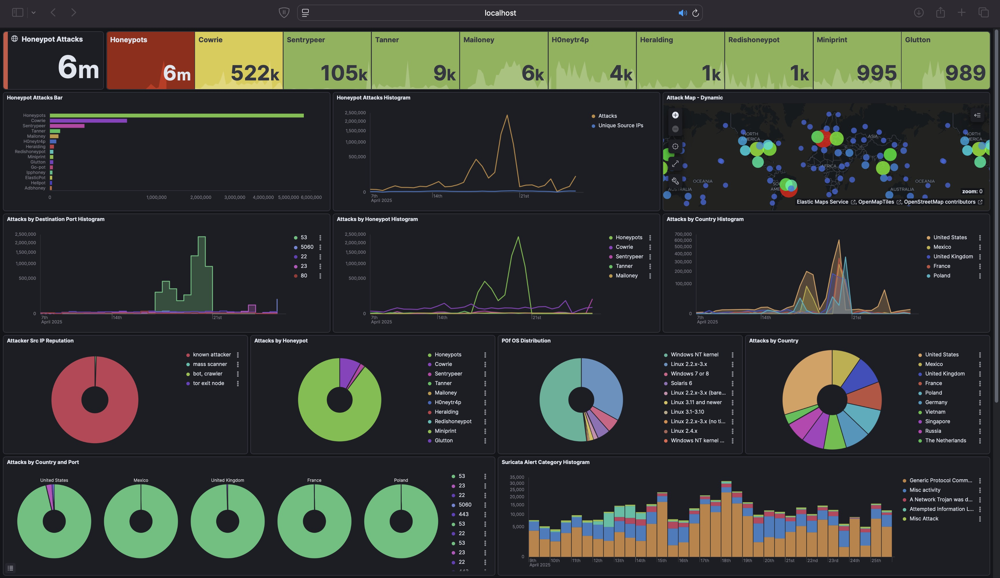
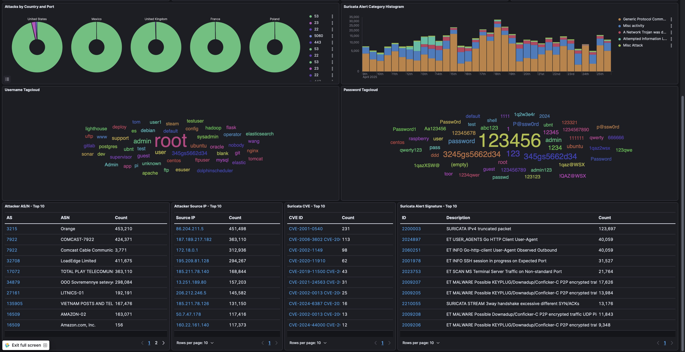
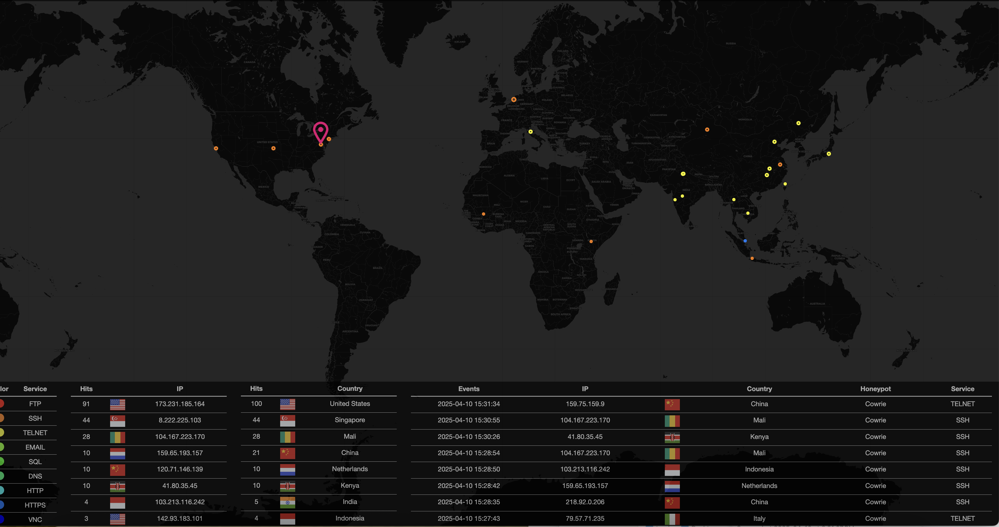
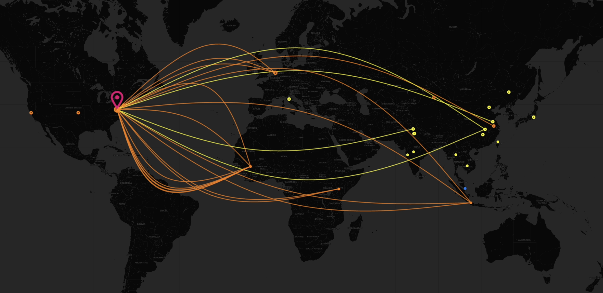

# Dashboard Examples & Visualizations 📊📈

This section showcases visual examples of the data collected and aggregated by the T-Pot honeypot environment. These dashboards, primarily viewed through Kibana (part of the ELK stack integrated into T-Pot), provide valuable insights into attacker origins, methods, and targeted services.

*(Note: The actual Kibana dashboards are accessed securely via an SSH tunnel to the T-Pot backend and are not publicly exposed. The live Attack Map uses sanitized data.)*

---

## Kibana Dashboards 🔍

Kibana is used to visualize the aggregated log data collected from the various honeypots. These dashboards transform raw attack data into actionable security intelligence.

### Kibana Dashboard - Overview Metrics

*This overview dashboard presents key threat metrics collected across all honeypot services, including:*
*   📈 Attack volume trends over time, highlighting peak attack periods.
*   🌍 Top source countries launching attacks against the honeypot.
*   🎯 Distribution of attack vectors by protocol and service type.
*   🚪 Most frequently targeted ports, revealing common attack entry points.
*   🍯 Honeypot hit counts by type, showing which services attract the most attention.

### Kibana Dashboard - Detailed Attack Analysis

*This detailed view focuses on specific attack patterns and vectors, revealing:*
*   🔑 SSH/Telnet brute force attempts, including common **usernames** and **passwords** used globally.
*   💻 Web-based exploit attempts against vulnerable services.
*   ⌨️ Command patterns and payloads executed by attackers after successful compromises.
*   🗺️ Geographical distribution of attacks over specific time periods.
*   💯 IP reputation data correlated with attack behaviors.
*   🚨 Top Suricata IDS alert signatures triggered by malicious traffic.

---

## T-Pot Attack Map 🗺️

The T-Pot Attack Map provides a real-time geographical visualization of attack sources and targets.

### Attack Map - Static View & Recent Events

*This view shows the geographic distribution of recent attacks and lists specific event details like Source IP, Country, Targeted Honeypot, and Service Protocol.*

### Attack Map - Live Action View 💥

*This dynamic visualization displays attacks **in real-time** as they occur. The lines connecting the attacker's origin country to the honeypot location are color-coded based on the targeted service protocol:*

*   🔴 **Red:** FTP (Port 21/20)
*   🟠 **Orange:** SSH (Port 22/2222)
*   🟡 **Yellow:** Telnet (Port 23/2223)
*   🟢 **Light Green:** Email (Ports 25, 110, 143, etc.)
*   🟢 **Green:** SQL (Ports 1433, 3306, etc.)
*   🟢 **Teal:** DNS (Port 53)
*   🔵 **Cyan:** HTTP (Ports 80, 8080, etc.)
*   🔵 **Blue:** HTTPS (Ports 443, 8443)
*   🔵 **Dark Blue:** VNC (Port 5900)
*   *(Refer to the full color key in `DataServer_v2_sanitized.py` or live map legend for other protocols like SNMP, SMB, RDP, SIP, ADB, etc.)*

*Observing the frequency and color of these real-time lines provides immediate insight into the types of attacks currently trending globally.*

---

## Security Intelligence Value 💡

These visualizations serve multiple security functions:
1.  **Threat Landscape Awareness:** Identifying current active threats and attack techniques in the wild.
2.  **Attack Pattern Recognition:** Revealing coordinated campaigns through correlated source data.
3.  **Emerging Threat Detection:** Highlighting new attack vectors or unusual activity spikes.
4.  **Defensive Prioritization:** Informing security controls and monitoring focus areas based on real-world tactics.

The data collected and visualized here directly informs security hardening efforts on production systems by revealing actual tactics used by attackers in the wild.

**View the live T-Pot Attack Map here: [honeypot.tarek.ai](https://honeypot.tarek.ai)**