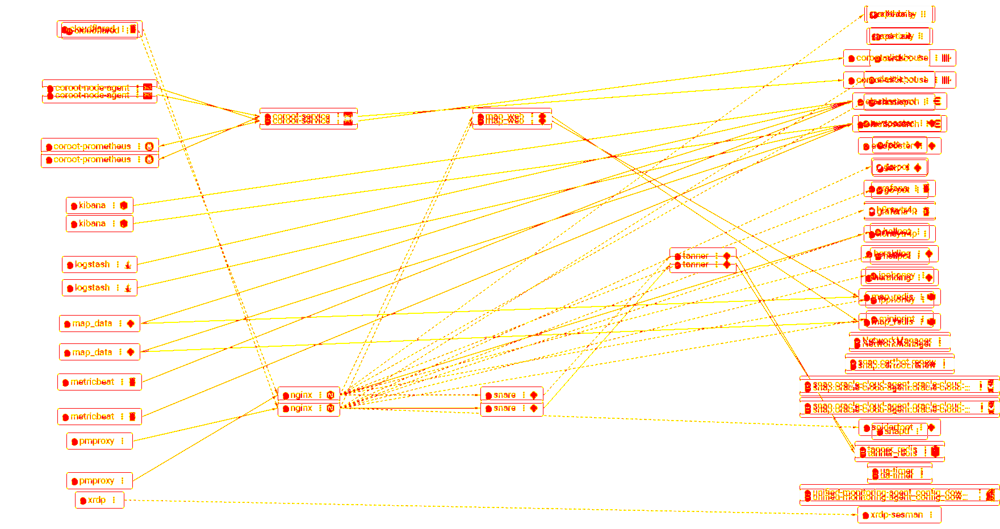
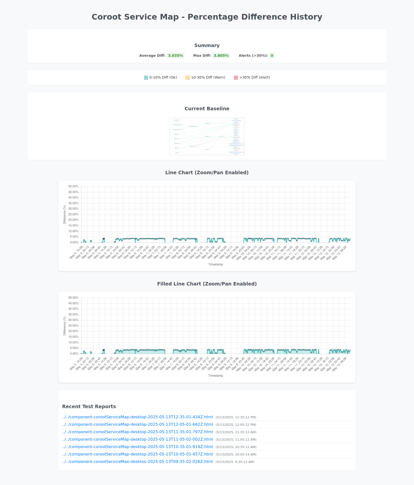

# Project ChronoView: Visual Anomaly Detection for Honeypot Security 🛡️🐤

Project ChronoView is an innovative automated monitoring system engineered to bolster the internal security of T-Pot Community Edition (CE) honeypot environments. It uniquely leverages Puppeteer for browser automation and Coroot's eBPF-generated service map to perform visual state assertion, detecting anomalous internal network connections or topological shifts that could signal a honeypot containment breach.

This system pioneers a visual approach to unmask threats that traditional monitoring might miss, particularly persistent threats designed to survive T-Pot's daily system reset cycles.

➡️ **For the full narrative, key discoveries, and in-depth technical validation, please see the [Full Case Study: Project ChronoView: Canary in the Container 🐤](./docs/Case_Study_Canary_in_the_Container.md).**

## Key Strategic Pillars & Innovations 💡

* **Targeted Visual Anomaly Detection:** Focuses on identifying unexpected internal network connections, which manifest as clear visual/topological changes on Coroot's service map.

    
    *Figure 1: ChronoView's diff image highlighting an unexpected internal 'elasticpot' to 'map_redis' connection.*

* **Reliable Daily Baseline via T-Pot Reset:** Aligns its "known good" baseline capture with T-Pot's daily system reset, ensuring a fresh reference point for detecting post-reset persistent threats.
* **Intelligent Noise Filtering ("Scenario B"):** Employs a two-stage "Diff-of-Tests" comparison to distinguish genuine anomalies from minor UI rendering variations (~3-4%), significantly reducing false positives and achieving an operational visual stability within a sub-1% variance.
* **Zero-Instrumentation Monitoring:** Utilizes Coroot's eBPF agent for external observation, preserving honeypot integrity.
* **Puppeteer as a State Assertion Engine:** Asserts the entire complex visual state rendered by Coroot against an established visual norm.

## Core Features ✨

* **Automated Coroot Interaction:** Navigates Coroot UI, applies filters (e.g., `~empty` namespace), captures screenshots.
* **Pixel-Based Differencing:** Uses `pixelmatch` for precise image comparison.
* **Dynamic Baseline Management:** `--update-baseline` flag with automatic archival of previous baselines.
* **Comprehensive Reporting:**
  * **Historical Data Log (`tests/screenshots/diff_history.json`):** Detailed JSON log of all test runs.
  * **Individual HTML Reports (`tests/reports/`):** Visual breakdown for each test.
  * **Interactive Dashboard (`report.html`):** Trend visualization.

        
        *Figure 2: ChronoView's historical dashboard showing stable diffs over one week.*

* **Cron-Ready Automation:** For continuous, unattended monitoring.
* **Configurable (`tests/config.js`):** URLs, selectors, time windows, etc.

## Setup ⚙️

1. **Prerequisites:** Node.js (v22+), npm, Git, a running Coroot instance, compatible Chromium for Puppeteer.
2. **Clone:** `git clone <your-repository-url> Project-ChronoView`
3. **Install:** `cd Project-ChronoView && npm install`
4. **Initial Dir Setup:** `node setup.js`
5. **Configure (`tests/config.js`):**
    * Set Coroot URLs (e.g., `http://localhost:9091/p/[COROOT_PROJECT_ID]/map`).
    * Verify `defaultTimeWindowParam` (e.g., `?from=now-1h`).
    * Confirm `corootServiceMap` UI selector.
6. **Establish Initial Baseline:** `node tests/component-test.js corootServiceMap --update-baseline` (Capture at a stable, "known good" state post T-Pot reset).

## Running Tests 🚀

* **Manual Comparison:** `node tests/component-test.js corootServiceMap`
* **Update Daily Baseline:** `node tests/component-test.js corootServiceMap --update-baseline`
* **Automated via Cron (Example):**

    ```cron
    5,35 * * * * cd /path/to/Project-ChronoView && /path/to/node tests/component-test.js corootServiceMap >> cron.log 2>&1
    15 10 * * * cd /path/to/Project-ChronoView && /path/to/node tests/component-test.js corootServiceMap --update-baseline >> cron.log 2>&1
    ```

## Viewing Results 📊

* **Interactive Dashboard:** Open `report.html` in a browser.
* **Individual Reports:** Stored in `tests/reports/` (example in `docs/examples/example_chronoview_report_elasticpot_event.html`).
* **Raw Data:** `tests/screenshots/diff_history.json`.

## Project Significance 🏆

Project ChronoView demonstrates advanced security monitoring, deep system understanding (Coroot, eBPF, Docker), ingenuity in problem-solving (Scenario B noise filtering), and a full project lifecycle. It is a unique case study in visual state assertion for security, valuable for IT security, sysadmin, and DevOps roles.

## Further Reading & Architecture 🗺️

* ➡️ **[Full Case Study: Project ChronoView: Canary in the Container 🐤](./docs/Case_Study_Canary_in_the_Container.md)** (Detailed narrative, discoveries, and technical validation)
* **[Project File Structure & Overview](./docs/00_project_overview_structure.md)**
* **[Foundational Research Excerpts](./docs/Foundational_Research.md)** 

## Future Work 🛠️

* Command-line override for Coroot time windows.
* Investigate/address Coroot visibility gaps for specific honeypot services.
* Integrate secure Coroot authentication for Puppeteer.
* Direct integration with alerting systems for 'significant' events.

---
