# Project ChronoView: Overview and Structure

This document provides a high-level overview of the Project ChronoView repository structure and key files.

## Purpose

Project ChronoView implements a visual anomaly detection system for monitoring the internal state of a T-Pot honeypot environment running on Docker. It uses Puppeteer to capture screenshots of a Coroot service map and performs pixel-based comparisons against a baseline image to detect unexpected network connections, potentially indicating a honeypot containment breach.

## Key Files and Directories

* **/ (Root)**
  * `Chronoview_README.md`: The main public-facing README detailing the project's purpose, setup, and usage.
  * `package.json`: Defines Node.js project metadata, dependencies (Puppeteer, Chalk, fs-extra, pixelmatch, pngjs), and devDependencies (ESLint, Chart.js).
  * `package-lock.json`: Locks dependency versions for reproducible builds.
  * `setup.js`: Initialization script to create necessary directories (`tests/screenshots/*`, `tests/reports`, etc.) and potentially a default `tests/config.js`. Run once during setup.
  * `report.html`: The main historical dashboard, visualizing diff percentages over time using data from `tests/screenshots/diff_history.json`.
  * `cron.log`: Log file capturing stdout/stderr from the automated cron job that runs the visual comparison tests. *Note: This file is live-updated by the cron process.*
  * `.gitignore`: Specifies intentionally untracked files/directories (e.g., `node_modules`).
  * `eslint.config.mjs`: Configuration for the ESLint JavaScript linter.

* **`docs/`**: Contains all documentation, design notes, and historical logs.
  * `00_project_overview_structure.md`: (This file) High-level overview and structure diagram.
  * `01_internal_development_log.md`: The primary, detailed internal log tracking the entire development process, including troubleshooting, configuration changes, baseline updates, and rationale. **Start here for deep context.**
  * `02_initial_design_doc_(Google_Deep_Research).txt`: The original design document evaluating different visualization tools and recommending Coroot.
  * `03_puppeteer_integration_notes.md`: Specific notes extracted from the design doc regarding Puppeteer configuration and challenges.
  * `archive_coroot_log_original.md`: An archived version of the internal log before consolidation.
  * `archive_design_doc_variant.md`: An archived variant of the design document.
  * `archive_generic_README.md`: An archived generic README file.

* **`logs/`**: Contains raw log files.
  * `format.txt`: Contains raw log data (likely from Suricata or similar, based on previous context).

* **`tests/`**: Contains all testing logic, configuration, and output artifacts.
  * `component-test.js`: The core script performing the visual comparison. It uses Puppeteer to launch Chromium, navigate to the Coroot URL, interact with filters, take screenshots, perform pixel comparison using `pixelmatch` (via a canvas-based approach to handle size differences), and generate individual HTML reports. Handles the `--update-baseline` flag.
  * `config.js`: Configuration file for `component-test.js`, defining target URLs, CSS selectors for the component and interaction elements, viewports, pixelmatch threshold, etc.
  * `report.js`: Helper script or module used by `component-test.js` to generate the individual HTML report files stored in `tests/reports/`.
  * `screenshots/`: Directory containing all image artifacts and history data.
    * `baseline/`: Stores the fixed baseline images (e.g., `corootServiceMap-desktop-BASELINE.png`) used for comparison. Also stores archived baselines (e.g., `...-BASELINE-old-<timestamp>.png`).
    * `test/`: Stores timestamped screenshots captured during each test run.
    * `diff/`: Stores timestamped difference images generated by `pixelmatch` when mismatches occur.
    * `diff_history.json`: JSON file logging the timestamp and percentage difference for each comparison run, used by `report.html`.
  * `reports/`: Stores the individual, timestamped HTML reports generated after each test run, showing the baseline, test, and diff images alongside metadata.
  * `vendor/`: Contains vendored libraries used by the reports (e.g., `chart.min.js`).
  * *(Other potential test files like `animation-test.js`, `performance-test.js` exist but seem less central to the core visual diffing task).*

* **`node_modules/`**: Contains installed Node.js dependencies (managed by `npm install`, typically ignored by Git).

## Project Diagram

The following diagram illustrates the relationship between the ChronoView project, its configuration, the Coroot stack it monitors, and external dependencies (reflecting the new `docs/` and `logs/` structure).

```mermaid
graph TD
    subgraph "TPOTCE Workspace (Parent)"
        PV[Project-ChronoView]
        CC[coroot-config]
    end

    subgraph "Project-ChronoView Directory"
        README_PV["Chronoview_README.md <br>(Main README)"]
        PKG_JSON[package.json]
        SETUP_JS[setup.js]
        REPORT_HTML["report.html <br>(Historical Dashboard)"]
        CRON_LOG["cron.log <br><b>(Live Updated)</b>"]
        subgraph "docs/"
            OVERVIEW_DOC["00_project_overview_structure.md <br><b>(This File)</b>"]
            MAIN_LOG["01_internal_development_log.md <br><b>(Primary Internal Log)</b>"]
            DESIGN_DOC["02_initial_design_doc_(Google_Deep_Research).txt"]
            PUPPETEER_NOTES[03_puppeteer_integration_notes.md]
            ARCHIVE_LOG[archive_coroot_log_original.md]
            ARCHIVE_DESIGN[archive_design_doc_variant.md]
            ARCHIVE_README[archive_generic_README.md]
        end
        subgraph "logs/"
            FORMAT_LOG[format.txt]
        end
        subgraph "tests/"
            TEST_JS["component-test.js <br>(Core Logic)"]
            CONFIG_JS["config.js <br>(Test Parameters)"]
            REPORT_JS["report.js <br>(Report Generation Helper)"]
             subgraph "screenshots/"
                DIFF_HIST[diff_history.json]
                BASELINE[baseline/]
                TEST_IMG[test/]
                DIFF_IMG[diff/]
            end
            REPORTS_OUT[reports/]
            VENDOR_LIB[vendor/]
        end
    end

    subgraph "coroot-config Directory (Sibling)"
         PROM_YML["prometheus.yml <br>(Config for Coroot Stack)"]
    end

    subgraph "External Systems/Concepts"
        CRON[System Cron]
        COROOT_STACK[Separate Coroot Docker Stack]
        COROOT_UI[Coroot Web UI]
    end

    %% Relationships
    CRON -- Executes --> TEST_JS
    CRON -- Appends to --> CRON_LOG
    TEST_JS -- Uses Config --> CONFIG_JS
    TEST_JS -- Uses Helper --> REPORT_JS
    TEST_JS -- Accesses --> COROOT_UI
    TEST_JS -- Writes --> tests/screenshots/baseline
    TEST_JS -- Writes --> tests/screenshots/test
    TEST_JS -- Writes --> tests/screenshots/diff
    TEST_JS -- Writes --> tests/screenshots/diff_history.json
    REPORT_JS -- Writes --> tests/reports
    REPORT_HTML -- Reads --> tests/screenshots/diff_history.json
    REPORT_HTML -- Reads --> tests/screenshots/baseline
    REPORT_HTML -- Uses Lib --> tests/vendor

    COROOT_STACK -- Serves --> COROOT_UI
    COROOT_STACK -- Configured By --> PROM_YML

    MAIN_LOG -- Explains Everything --> PV
    MAIN_LOG -- Explains --> CRON
    MAIN_LOG -- Explains --> COROOT_STACK
    MAIN_LOG -- Explains --> PROM_YML

    OVERVIEW_DOC -- Describes --> PV
    DESIGN_DOC -- Informs --> PV
    PUPPETEER_NOTES -- Details Part of --> TEST_JS

    SETUP_JS -- Creates --> tests/screenshots
    SETUP_JS -- Creates --> tests/reports
    PKG_JSON -- Defines Dependencies For --> TEST_JS & Others
```

