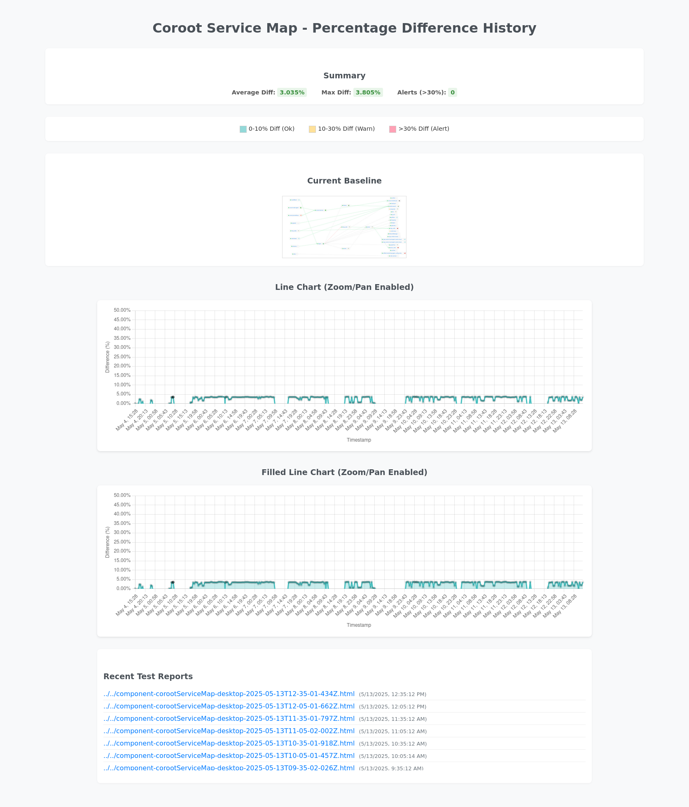
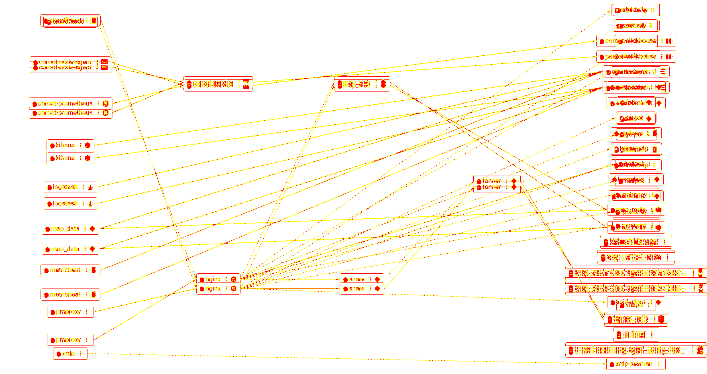

# Case Study: Project ChronoView - Canary in the Container 🐤 – Visual State Assertion for Honeypot Security

## I. Introduction: The Sysadmin's Dilemma & My Unconventional Solution 💡

As an IT professional managing a T-Pot Community Edition (CE) honeypot deployment, I gained valuable threat intelligence but also identified a significant risk inherent in my co-hosted environment: the potential for a **honeypot containment breach**. I was concerned that an attacker who compromised one of my honeypot containers could pivot to attack other internal services or even the underlying host system. Traditional logging approaches, while essential, seemed insufficient for this specific challenge; honeypot logs are often voluminous, making critical internal events hard to discern, and signature-based tools risk missing novel internal lateral movement techniques.

Faced with this, I conceived Project ChronoView as an innovative, proactive solution: an automated visual "canary in the container." By leveraging browser automation with Puppeteer and the rich network topology visualizations provided by Coroot (powered by eBPF), I aimed to create a system that could visually monitor my T-Pot's internal network state and provide rapid, intuitive detection of anomalous connections that might otherwise go unnoticed.

## II. The Spark: From Web Testing Framework to Security Solution ✨

My journey to developing ChronoView was an evolutionary one, rooted in lessons learned from a previous project. While working on enhancing the security of my T-Pot's public Attack Map (a data sanitization effort detailed in a separate case study: `../../Troubleshooting_Case_Studies/Attack_Map_Data_Sanitization_Case_Study.md`), I had initially attempted to use Puppeteer for client-side data manipulation. Though that specific client-side approach proved fragile due to browser-based complexities, the experience was invaluable, highlighting Puppeteer's robust capabilities for browser automation and precise DOM interaction.

This sparked a new idea: could the core technology of a `Visual_Web_Testing_Framework` I had previously conceptualized be repurposed and specialized? Instead of pursuing a general web testing tool, or another conventional monitoring approach, I saw an opportunity to address a unique security challenge: could I use Puppeteer to assert the *visual state* of a security-relevant dashboard to detect threats in real-time? This was not merely about finding "10,000 ways that won't work," but about recognizing the unique strengths of a tool and matching them to a fitting problem, turning a potential dead-end into a focused innovation.

## III. The Vision: "Why Visual?" – Addressing a Unique Observability Gap 🤔

To ground this unconventional approach, I undertook foundational research to evaluate visualization tools suited for internal security monitoring within my specific T-Pot CE Docker environment. This review (key excerpts in `docs/Foundational_Research.md`) assessed options against criteria like visual clarity for network topology, implementation feasibility (ARM64/Docker), resource impact, and, crucially, the principle of zero-instrumentation. The findings strongly affirmed my hypothesis that **Coroot**, with its eBPF-powered service map, offered the optimal platform for ChronoView's visual detection strategy.

My "Why Visual?" argument for detecting honeypot containment breaches rests on several interconnected pillars:

* **The Target Anomaly *is* Fundamentally Visual & Topological:** A honeypot making an unexpected internal connection (e.g., `elasticpot` attempting to communicate with `map_redis`) fundamentally alters the network topology graph. As the research highlighted, *seeing a new connection line appear* on Coroot's map provides a far more direct, rapid, and intuitive understanding of a potential breach than attempting to parse thousands of log entries or waiting for a numerical metric to cross a predefined threshold.
* **Leveraging Human Intuition for Pattern Recognition:** The human eye excels at spotting anomalous patterns in visual data. Unexpected lines, missing nodes, or unusual "starburst" connection patterns (indicative of internal scanning) "jump out" in a graphical display, often enabling quicker initial assessment by an analyst reviewing ChronoView's findings.
* **The Zero-Instrumentation Imperative via Coroot & eBPF:** This was a non-negotiable requirement for monitoring a honeypot environment. Coroot's eBPF agent monitors container interactions *externally* from the host kernel level, without requiring any agents or modifications *inside* the honeypot containers themselves. This preserves the integrity and realism of the honeypots, ensuring the monitoring mechanism is invisible from within the container and does not interfere with honeypot operations or tip off attackers.
* **Puppeteer as a "Visual State Assertion Engine":** I designed ChronoView to use Puppeteer not merely as a pixel comparator, but as a powerful engine to assert that the *entire complex visual output* of Coroot—which itself is a translation of the live Docker network state—conforms to an expected, known-good baseline. This approach, as noted in the foundational research, "cleverly bypasses the need to programmatically define and validate *all* permissible network states and transitions... a task that would be exceedingly complex and brittle to maintain." ChronoView focuses on validating the *rendered truth* of the network state.
* **Raising the Bar for Malware Evasion:** For malware to go undetected by ChronoView after establishing an unauthorized internal connection, it faces a multifaceted challenge. It would need to not only suppress its logs and evade other conventional detection mechanisms but also ensure its activity results in *no significant visual change to the Coroot service map relative to ChronoView's established noise profile*. Alternatively, it would have to perfectly mimic the ~3-4% visual rendering "jitter" that ChronoView is calibrated to understand. Masking a new connection line while precisely controlling the overall visual rendering within such tight tolerances presents a considerably more complex evasion problem than simply deleting log entries.

With this vision solidified, I proceeded to implement ChronoView, using Coroot for its unparalleled eBPF-driven visibility and Puppeteer for robust, automated visual assertion, all guided by a strategy to make the system reliable in a real-world, dynamic environment.

## IV. The Bedrock of Stability: The Daily Reset Baseline Strategy 🔄

A primary challenge in operationalizing any anomaly detection system, especially a visual one, is establishing a truly reliable baseline in an environment as inherently dynamic and targeted as T-Pot. My early experiments confirmed that even minor, benign system activities or slight variations in Coroot's rendering could alter its service map over time.

The pivotal insight (detailed in `docs/01_main_dev_log.md`) came from a decision to strategically leverage an existing operational characteristic of my T-Pot CE deployment: **its daily automated system reset**, which typically occurs around 10:00 UTC and includes a full host reboot. This daily cycle provided a unique and powerful advantage:

* **A "Known Good State" Every 24 Hours:** I configured ChronoView (via `cron`) to automatically capture its baseline image at 10:15 UTC, shortly after the daily reset completed and all T-Pot and Coroot services had fully stabilized. This ensured that each day started with a fresh, clean reference point, representing a system state theoretically free from the previous day's transient compromises or accumulated visual "noise."
* **Targeting Persistent Threats:** This daily re-baselining strategy inherently focused ChronoView's detection capabilities on identifying more sophisticated threats—those designed to achieve persistence and survive the daily reset cycle. If malware re-established itself post-reset and initiated new internal activity, ChronoView would compare this against the pristine post-reset baseline, making such deviations more apparent. This addressed a critical concern for the long-term security of the co-hosted environment.

This "Scenario A" approach—anchoring all visual comparisons to a fresh, post-reset daily baseline, and using a consistent 1-hour Coroot time window (`?from=now-1h`) for all captures—became the foundational strategy for ChronoView's monitoring operations.

## V. The "Visual Jitter" Puzzle & The 0.02% Revelation 🧩

While the daily reset strategy provided a strong foundation, initial automated comparisons against this fresh daily baseline consistently reported small, non-zero pixel differences, typically falling within the **~3.4% to 3.8% range** (`docs/01_main_dev_log.md`, "Investigating Diff Percentage"). This occurred even when no deliberate system changes were made and no security incidents were known. This "visual jitter" was a significant concern, as it threatened to flood any alerting mechanism with false positives, undermining the system's utility.

To understand if this was genuine network fluctuation or an artifact of the visualization and capture process, I conducted a critical diagnostic test (around May 5th, 09:12 UTC):

1. A Coroot map screenshot was captured immediately *before* initiating a manual T-Pot system restart.
2. After the T-Pot system rebooted and all services (including Coroot) had fully stabilized, another screenshot was captured.
3. These two images, representing the system in a stable state before and after a clean restart (where the underlying network topology *should* have been identical), were then compared using `pixelmatch`.

The result was striking and formed a key "Aha!" moment: the visual difference between these two "identical underlying state" images was a mere **0.02%**.


*Figure A - The minimal 0.02% visual diff (diff image shown) between Coroot maps captured immediately before and after a system restart (post-stabilization). This vividly quantified the baseline rendering noise and underscored the need for Scenario B's intelligent filtering.*

This experiment confirmed that Coroot *could* render with extreme visual consistency. The persistent ~3-4% difference observed when comparing against the *daily baseline* (even a fresh one taken hours apart or on different days) was therefore primarily attributable to minor, benign rendering variations inherent in the complex Coroot SVG map—such as sub-pixel rendering nuances, slight dynamic adjustments in SVG element heights, or font rendering shifts accumulating over time or across distinct browser rendering sessions. I had successfully identified and quantified ChronoView's "visual noise floor."

## VI. The Breakthrough: Scenario B – Intelligent Noise Filtering 💡

The challenge was clear: to make ChronoView a reliable security tool, it needed to intelligently distinguish the ~3-4% "visual noise floor" from genuine, potentially malicious, visual anomalies. Simply raising the alert threshold would risk missing subtle but important changes.

This led to the engineering of **Scenario B**, the "Diff-of-Tests" strategy (`docs/01_main_dev_log.md`, "Implementing Scenario B"). This introduced a crucial conditional, two-stage comparison logic into `tests/component-test.js`:

1. **Primary Check:** The current Coroot map screenshot (`test_now`) is compared against the daily baseline (`baseline_daily`), yielding `mismatchPercentagePrimary`.
2. **Noise Threshold & Conditional Secondary Check:** A `NOISE_THRESHOLD_PERCENT` was established at 4.0% (just above the maximum observed rendering noise).
    * If `mismatchPercentagePrimary <= 4.0%`, the state is considered a 'match' (within normal noise).
    * If `mismatchPercentagePrimary > 4.0%`, ChronoView retrieves the screenshot from the *immediately preceding successful test run* (`test_previous`) via `diff_history.json` and performs a secondary comparison: `test_now` vs. `test_previous`, yielding `secondaryMismatchPercentage`.
3. **Intelligent Interpretation:**
    * If `secondaryMismatchPercentage < 1.0%` (a tight `SECONDARY_THRESHOLD_PERCENT`), the high primary diff is classified as benign rendering 'noise' relative to the older daily baseline, as the system is consistent with its very recent state.
    * If `secondaryMismatchPercentage >= 1.0%`, it indicates a 'significant', genuine visual change has occurred recently *both* against the daily baseline *and* the immediate past, strongly suggesting a true anomaly. In this case, `process.exitCode = 1` is set, enabling external alerting mechanisms.

This sophisticated filtering allowed ChronoView to "see through" the normal visual jitter. Implementation also involved enhancing PNG processing with canvas-based comparisons to robustly handle minor image dimension variations without failing the diff process. The core logic is exemplified below:

```javascript
// In tests/component-test.js (Simplified Scenario B Logic)
const NOISE_THRESHOLD_PERCENT = 4.0;
const SECONDARY_THRESHOLD_PERCENT = 1.0;

// Primary comparison result
// const mismatchPercentagePrimary = ...; 

let finalStatus = 'match';
let secondaryMismatchPercentage = -1; // Default if not triggered

if (mismatchPercentagePrimary > NOISE_THRESHOLD_PERCENT) {
    console.warn(`⚠️ Primary diff (${mismatchPercentagePrimary.toFixed(2)}%) exceeds noise threshold (${NOISE_THRESHOLD_PERCENT}%)... Performing secondary check.`);
    const previousTestImagePath = findPreviousTestImageFromHistory(diffHistoryArray, currentTestTimestamp); // Simplified lookup
    
    if (previousTestImagePath) {
        // secondaryMismatchPercentage = await compareImages(currentTestImageObject, previousTestImagePath);
        if (secondaryMismatchPercentage < SECONDARY_THRESHOLD_PERCENT) {
            finalStatus = 'noise';
            console.log(`  Secondary diff (${secondaryMismatchPercentage.toFixed(2)}%) within threshold. Primary diff likely rendering noise.`);
        } else {
            finalStatus = 'significant';
            console.error(`  ⚠️ Secondary diff (${secondaryMismatchPercentage.toFixed(2)}%) EXCEEDS threshold! Significant change detected!`);
            process.exitCode = 1;
        }
    } else {
        console.warn('  Could not find a valid previous test image for Scenario B. Treating primary diff as is, potentially significant if high.');
        if (mismatchPercentagePrimary > SOME_HIGHER_ABSOLUTE_THRESHOLD) finalStatus = 'significant'; // Fallback
    }
}
// finalStatus ('match', 'noise', 'significant') is then logged and used in reports.
```

## VII. Validation: Consistent Monitoring & The "1% Margin" of Operational Noise ✅

With the daily reset baseline strategy and Scenario B's intelligent noise filtering fully implemented, Project ChronoView was subjected to approximately one week of continuous, automated monitoring of the live T-Pot honeypot environment (May 6th - May 13th, 2025). Data from 316 successful automated comparisons provided strong validation.

**Key Performance Metrics:**

* **Average Primary Difference (vs. Daily Baseline):** **3.035%**
* **Maximum Primary Difference (vs. Daily Baseline):** **3.805%**
* **Perfect Matches (0.000% Diff vs. Daily Baseline):** 2 instances.
* **Scenario B Activation:** During this stable week, the maximum observed primary diff (3.805%) consistently remained *below* the 4.0% `NOISE_THRESHOLD_PERCENT`. Consequently, all deviations were correctly classified as 'match' (within expected operational noise), and the secondary "diff-of-tests" was not required to re-classify any events. No 'significant' alerts were generated.


*Figure B - Project ChronoView's historical dashboard (`report.html`) displaying highly stable primary diff percentages (consistently between ~3-3.8%) against the daily baseline over a one-week period (May 6-13, 2025), demonstrating effective management of Coroot's inherent visual rendering noise.*

This tight clustering of the average (3.035%) and maximum (3.805%) primary differences empirically defined ChronoView's operational "visual noise floor" for the Coroot map at roughly 3-4%. Remarkably, the daily variance around this average was typically **less than 1 percentage point** (Max 3.805% - Avg 3.035% ≈ 0.77%). This level of precision, achieved while monitoring a live and actively attacked honeypot, proved ChronoView could maintain an accurate understanding of the "normal" visual state, ensuring that future deviations significantly outside this band would be high-confidence indicators of genuine system state changes.

## VIII. The "Aha!" Moment Visualized: Detecting Emergent Threats with ChronoView 😲

Beyond stable monitoring, ChronoView's true value lies in detecting unexpected topological changes. A simulation I conducted on May 5th, 2025 (detailed in `docs/strategic_notes.md`) perfectly illustrated this.

**The Simulation:** I executed a `wget http://google.com` command from within the `elasticpot` honeypot container, mimicking an unauthorized outbound call—a common attacker behavior to test connectivity or download further tools.

**The Discovery – More Than Just an Outbound Call:**
Manual observation of the Coroot service map before and after this simulation revealed a critical, unexpected *secondary internal effect*:

* **Before:** `elasticpot` exhibited its standard network connections.
    
    *Figure C - Coroot map showing the 'elasticpot' honeypot and its connections *before* the simulated outbound `wget` command.*

* **After:** A new, direct internal connection line starkly appeared between `elasticpot` and the `map_redis` service (an internal component of T-Pot). The `elasticpot` node itself also visibly shifted its position on the map.
    
    *Figure D - Coroot map *after* the `elasticpot` `wget` simulation, clearly showing the new, unauthorized internal connection from 'elasticpot' to 'map_redis'.*

**ChronoView's Automated Detection:**
Project ChronoView's automated run covering this period (timestamped `2025-05-05T20:05:13Z` in `diff_history.json`) captured this anomaly:

* It detected a **~3.70% primary visual difference** against the May 5th daily baseline.
* The generated diff image precisely highlighted the new `elasticpot -> map_redis` connection line and the node's shift.


*Figure E - Project ChronoView's diff image for the `elasticpot` simulation, automatically highlighting the anomalous new connection to 'map_redis' and the 'elasticpot' node's positional change.*


*Figure F - Snippet from ChronoView's individual HTML report for the `elasticpot` event, displaying the ~3.70% detected difference alongside the visual evidence (baseline vs. test vs. diff).*

**Significance – The "Visual Necessity" Confirmed:**
This `elasticpot -> map_redis` event powerfully underscored my "visual necessity" principle. While logs from the `elasticpot` container itself were found to be non-verbose for such `wget` activity, and detecting the *secondary internal connection to `map_redis`* through log correlation alone would be challenging and delayed, ChronoView provided immediate, clear visual evidence. The generated diff image, even with a ~3.70% overall change (which was within the primary noise threshold for that day and thus wouldn't trigger a Scenario B secondary check), presented unambiguous, qualitatively significant intelligence to a human reviewer. It demonstrated ChronoView's capability as a "visual state assertion engine" to uncover emergent behaviors that purely numerical or log-based systems might miss. This highlighted the potential for future enhancements in automatically classifying such distinct *topological* changes even if their overall pixel footprint is initially small.

## IX. Technical Implementation Highlights 🛠️

ChronoView's robust functionality was achieved through several key technical implementations:

1. **Puppeteer Configuration for Coroot Interaction:** Precision in browser automation was key. Puppeteer was configured to run headless, navigate to the specific Coroot service map URL (including consistent time window parameters like `?from=now-1h`), and apply specific UI element selectors to interact with Coroot's filters (e.g., selecting the `~empty` namespace to focus on relevant inter-container traffic).

    ```javascript
    // In tests/component-test.js (Relevant Puppeteer Interaction Logic)
    await page.goto(corootUrlWithTimeWindow, { waitUntil: 'networkidle2' });
    await page.waitForTimeout(INITIAL_LOAD_DELAY_MS); // Allow initial rendering
    await page.click(config.components.corootServiceMap.namespaceDropdownTrigger);
    await page.waitForTimeout(UI_INTERACTION_DELAY_MS);
    await page.click(config.components.corootServiceMap.namespaceOptionEmpty);
    await page.waitForTimeout(UI_INTERACTION_DELAY_MS);
    if (config.components.corootServiceMap.namespaceCloseButton) {
      await page.click(config.components.corootServiceMap.namespaceCloseButton);
      await page.waitForTimeout(MAP_REDRAW_DELAY_MS);
    }
    const targetElement = await page.$(config.components.corootServiceMap.selector);
    const screenshotBuffer = await targetElement.screenshot();
    ```

2. **Resilient Canvas-Based Image Comparison:** To overcome issues with minor SVG height variations causing `pixelmatch` to fail or report misleadingly high diffs due to dimension mismatches, I implemented a canvas-based comparison. Both baseline and test images are drawn onto new canvases of common maximum dimensions before pixel data is extracted for `pixelmatch`. This ensures a diff is always generated, with dimension mismatches noted as warnings rather than critical errors.

    ```javascript
    // In tests/component-test.js (Canvas Comparison Logic Snippet)
    const maxWidth = Math.max(baselineImage.width, testImage.width);
    const maxHeight = Math.max(baselineImage.height, testImage.height);
    const diffCanvas = createCanvas(maxWidth, maxHeight);
    const diffCtx = diffCanvas.getContext('2d');
    // ... (draw baselineImage and testImage onto their own canvases of maxWidth, maxHeight) ...
    const numDiffPixels = pixelmatch(
        baselineCanvasData, testCanvasData, diffCtx.getImageData(0, 0, maxWidth, maxHeight).data, 
        maxWidth, maxHeight, { threshold: pixelmatchOptions.threshold }
    );
    ```

3. **Automated Workflow with Cron:** Two primary `cron` jobs orchestrate ChronoView's continuous operation: one for the daily baseline update post-T-Pot reset, and another for frequent (e.g., twice hourly) comparison checks. All output is logged for traceability.

4. **Comprehensive Reporting (`report.html` & Individual Reports):** The client-side JavaScript dashboard (`report.html`) using Chart.js provides an interactive historical view of diff percentages, while individual HTML reports offer detailed side-by-side visual evidence for each test run, including Scenario B outcomes.

## X. Conclusion: The Canary Sings – A Novel Layer in Defense-in-Depth 🏁

Project ChronoView successfully demonstrated that an unconventional, visually-driven approach can provide a valuable and effective layer of security monitoring for complex containerized environments like T-Pot. By transforming Puppeteer into a "visual state assertion engine" for Coroot's eBPF-generated network maps, it addressed the specific challenge of detecting subtle internal honeypot containment breaches.

The strategic alignment with T-Pot's daily reset for baseline integrity, coupled with the intelligent "Diff-of-Tests" (Scenario B) noise filtering, resulted in a system capable of operating with a remarkably low operational visual noise margin (sub-1% variance around a ~3-4% mean). This high fidelity allows for confident detection of genuine anomalies, as exemplified by the `elasticpot -> map_redis` simulation.

Key to its success was the principle of **zero-instrumentation**, preserving honeypot realism. Project ChronoView is not a replacement for traditional security tools but a potent augmentation within a **defense-in-depth** strategy. It offers an intuitive, rapid visual check for topological anomalies that might evade other methods, especially those involving emergent behaviors or threats attempting to mask their activity within typical rendering "jitter"—a jitter ChronoView learned to understand and filter. This project underscores the value of creative problem-solving, iterative refinement, and applying modern observability techniques to challenging security paradigms.

## XI. Key Lessons Learned 🧑‍🎓

1. **Visual State Assertion is Powerful for Topological Anomalies:** For certain threats in complex systems, validating a trusted *visual representation* of state can be more effective and intuitive than purely programmatic checks.
2. **Strategic Baselining is Crucial in Dynamic Systems:** Leveraging inherent system cycles (like T-Pot's daily reset) can create highly reliable reference points, drastically improving signal-to-noise.
3. **Quantify, Understand, and Filter "Noise":** The ~3-4% "visual jitter" was a critical challenge. Isolating it (the 0.02% test) and engineering a solution (Scenario B) turned a limitation into a demonstration of robust engineering.
4. **Zero-Instrumentation Preserves Target Integrity:** Monitoring sensitive environments like honeypots externally (via eBPF) is key to maintaining their effectiveness.
5. **Unconventional Thinking Can Yield Unique Strengths:** The initially unorthodox idea of "watching pictures for security" led to a system with unique detection capabilities against threats that might try to blend in with minor visual rendering variations.

## XII. Future Work 🛠️

* **Conduct Controlled High-Deviation Simulations:** Intentionally trigger more significant visual changes to fully exercise and validate Scenario B's 'significant' change detection pathway and fine-tune its secondary thresholds.
* **Implement Tiered Automated Responses:** Explore integrating ChronoView with automated actions based on `final_status` (e.g., notification for 'noise', isolation or T-Pot "Blackhole Mode" for 'significant').
* **Enhance Anomaly Characterization:** Move beyond pixel percentage to characterize the *type* of visual change (new node, new connection, etc.), potentially using more advanced image analysis or Coroot API data.
* **Address Coroot Visibility Gaps:** Investigate why certain honeypots might not always appear on the Coroot map.
* **Integrate Secure Coroot Authentication:** Implement robust authentication handling within Puppeteer.
