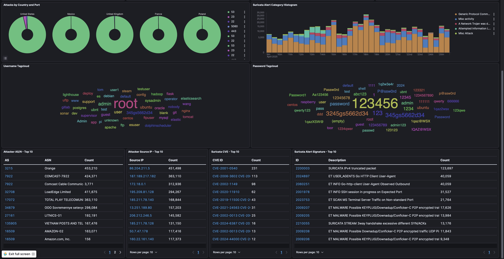

# Tarek Aloch - IT / Security Portfolio

## Introduction

Welcome! Consider this my digital portfolio where I document my hands-on experience with IT Systems Administration, Oracle Cloud Infrastructure, practical Cybersecurity Operations, time-saving Automation solutions, and the complex Troubleshooting challenges I've solved along the way. I'm passionate about building secure, efficient systems and hope my work gives you some insight into my technical approach and problem-solving style.

## Focus Areas & Key Highlights ✨

*   **Linux Administration:** Ubuntu Server setup, Systemd service management, performance tuning, package management, user administration, BASH scripting.
*   **Networking:** TCP/IP fundamentals, DNS resolution (diagnosis & configuration), Firewall management (iptables, OCI firewall), network troubleshooting.
*   **Secure Access Architecture:** 🔐 **Designed and implemented a robust remote access strategy leveraging advanced SSH tunneling (`LocalForward`) and `~/.ssh/config` management to provide secure, multiplexed access to multiple internal services (Web UIs, RDP, etc.) through a single, hardened SSH entry point, significantly minimizing the external attack surface.** *(See the dedicated [Secure Access via SSH Config Case Study](./Troubleshooting_Case_Studies/1_CaseStudy_Secure_Multiplexed_Access_via_SSH_Config.md))*
*   **Cybersecurity:** Honeypot deployment & management (T-Pot CE), basic threat intelligence analysis (via ELK), log analysis principles, data sanitization techniques, server hardening best practices, IDS concepts (Suricata).
*   **Containerization:** Docker & Docker Compose (deployment, networking, volume management), container lifecycle management, Portainer administration & troubleshooting.
*   **Web Server / Proxy:** Nginx configuration (reverse proxy, virtual hosts, TLS/SSL setup, security headers, location blocks).
*   **Scripting & Automation:** 
    *   Bash shell scripting (automation, monitoring).
    *   Python (data processing, basic API interaction - demonstrated in sanitization script).
    *   **Node.js (Web Test Automation via Puppeteer).**
*   **Testing & QA Concepts:** 
    *   **Visual Regression Testing.**
    *   **Web Performance Monitoring & Metrics Collection.**
    *   **Animation Capture & Comparison.**
*   **Troubleshooting:** Systematic diagnosis and resolution of complex, multi-layered issues involving OS, networking, containerization, and application conflicts. *(See Case Studies section)*.
*   **Cloud Infrastructure:** Oracle Cloud Infrastructure (OCI) VM instance deployment and management, network security groups.

## Featured Project: T-Pot CE Honeypot Co-Hosting & Customization 🍯🛡️

This project details the deployment and management of a complex T-Pot CE honeypot environment. **A key challenge addressed was successfully co-hosting the multi-container T-Pot stack alongside existing production web services on a single OCI ARM instance.** Overcoming this required:

*   Developing custom **Nginx reverse proxy routing strategies** to logically separate honeypot traffic from legitimate web traffic.
*   Implementing advanced **firewall rule management** (`iptables` via `systemd`) to prevent T-Pot's dynamic blocking from interfering with essential administrative access.
*   Engineering a **server-side data sanitization solution** (Python modification) to securely expose the live Attack Map visualization via Cloudflare Tunnel.
*   Establishing a **secure and scalable method for accessing internal management tools** (like Kibana, Portainer, etc.) using the SSH Tunneling strategy detailed in the [Secure Access Case Study](./Troubleshooting_Case_Studies/1_CaseStudy_Secure_Multiplexed_Access_via_SSH_Config.md).

This project provided valuable hands-on experience in threat intelligence gathering, system integration, secure configuration, and complex problem-solving.

## T-Pot Honeypot Visualization 📊🌍

### Global Attack Visualization

\
\

*The live Attack Map provides a real-time geographic visualization of attacks targeting the honeypot infrastructure.*

### Internal Honeypot Dashboard

*The internal Kibana dashboard aggregates detailed logs and metrics from various honeypot sensors for analysis.*

👀 **Dive deeper into the collected threat intelligence: [View Attack Visualizations & Dashboard Examples](./Honeypot_Project_T-Pot_CE/5_Dashboard_Examples/)**
\
\
## Troubleshooting & Problem Solving Case Studies 🕵️‍♂️🔧

Effective troubleshooting is critical in IT. Documenting challenges and their resolutions can help others uncover key bugs and make significant breakthroughs. This section contains detailed case studies showcasing the investigation and resolution of significant technical challenges encountered.

A particularly complex challenge involved **securing the public Attack Map by implementing server-side data sanitization**; the full investigation is detailed within the T-Pot project section below.

**➡️ [View Troubleshooting Case Studies](./Troubleshooting_Case_Studies/)**
*(Includes: [1_Secure Multiplexed Access via SSH Config](./Troubleshooting_Case_Studies/1_CaseStudy_Secure_Multiplexed_Access_via_SSH_Config.md))* 
*(See Also: [Attack Map Data Sanitization Case Study](./Honeypot_Project_T-Pot_CE/4_Data_Sanitization_Subproject/CaseStudy_Attack_Map_Data_Sanitization.md))* 

## Custom Automation & Monitoring ⚙️

To improve environment stability and visibility, custom tooling was developed. This section features a comprehensive, **configuration-agnostic Bash script** created specifically for **deep health monitoring** of the T-Pot deployment. It dynamically detects services and performs checks beyond basic uptime, including log analysis, resource usage, network accessibility, and complex firewall rule validation.

**➡️ [See Automation & Monitoring Scripts](./Custom_Automation_And_Monitoring/)**

## Visual Web Testing Framework 📸

Developed a comprehensive testing framework using Node.js and Puppeteer designed to automate visual validation, animation comparison, and performance benchmarking for web applications.

*   **Key Features:** Pixel-by-pixel visual regression testing, animation sequence capture (GIF comparison via ImageMagick), performance metrics collection (FCP, Load Time, etc.), configurable viewports/components, and detailed HTML reporting.
*   **Skills Demonstrated:** Node.js, Puppeteer automation, JavaScript (ES6+ Async/Await), testing methodologies, configuration management.

**➡️ [Explore the Visual Web Testing Framework](./Visual_Web_Testing_Framework/)**

## Server Security & Hardening Practices 🔒

Implementing foundational security measures is essential! This section outlines baseline host hardening practices and the **server-side configuration** required for the secure remote access methodology employed.

**➡️ [Review Security Hardening Documentation](./Server_Security_Hardening/)** *(Details server-side SSH hardening; see Case Studies for client-side SSH config strategy)*

## Other Skills & Tools Explored 💡

Beyond the core T-Pot project, other tools were installed and configured on the server environment, including Cockpit for web-based administration and explorations into Grafana/Prometheus for monitoring.

**➡️ [See Other Tools & Skills Explored](./Other_Skills_And_Tools_Explored/)**

## Contact 📫

Connect with me on LinkedIn: [https://www.linkedin.com/in/tarek-aloch-6b9842219/](https://www.linkedin.com/in/tarek-aloch-6b9842219/)

Check out my website: [tarek.ai](https://tarek.ai)

View the live T-Pot Attack Map: [honeypot.tarek.ai](https://honeypot.tarek.ai)