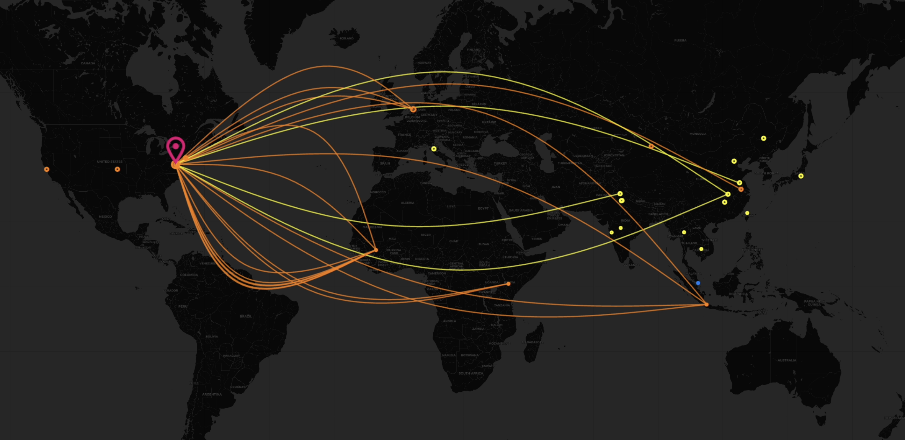

# Tarek Aloch - IT / Security Portfolio

## Introduction

Welcome! Consider this my digital portfolio where I document my hands-on experience with IT Systems Administration, Oracle Cloud Infrastructure, practical Cybersecurity Operations, time-saving Automation solutions, and the complex Troubleshooting challenges I've solved along the way. I'm passionate about building secure, efficient systems and hope my work gives you some insight into my technical approach and problem-solving style.

**More updates coming soon!** 

## Focus Areas 

*   **Linux Administration:** Ubuntu Server setup, Systemd service management, performance tuning, package management, user administration, BASH scripting.
*   **Networking:** TCP/IP fundamentals, DNS resolution (diagnosis & configuration), Firewall management (iptables, UFW), advanced SSH tunneling & port forwarding, network troubleshooting.
*   **Cybersecurity:** Honeypot deployment & management (T-Pot CE), basic threat intelligence analysis (via ELK), log analysis principles, data sanitization techniques, server hardening best practices, IDS concepts (Suricata).
*   **Containerization:** Docker & Docker Compose (deployment, networking, volume management), container lifecycle management, Portainer administration & troubleshooting.
*   **Web Server / Proxy:** Nginx configuration (reverse proxy, virtual hosts, TLS/SSL setup, security headers, location blocks).
*   **Scripting:** Bash shell scripting (automation, monitoring), Python (data processing, basic API interaction - demonstrated in sanitization script).
*   **Troubleshooting:** Systematic diagnosis and resolution of complex, multi-layered issues involving OS, networking, containerization, and application conflicts.
*   **Cloud Infrastructure:** Oracle Cloud Infrastructure (OCI) VM instance deployment and management, network security groups.

## Featured Project: T-Pot CE Honeypot Co-Hosting & Customization

This section details the deployment and management of a complex T-Pot CE honeypot environment. **A key challenge addressed was successfully co-hosting the multi-container T-Pot stack alongside existing production web services on a single OCI ARM instance.** This required developing custom Nginx reverse proxy routing strategies, advanced firewall rule management to prevent T-Pot from blocking administrative access, and implementing server-side data sanitization to protect infrastructure details on public dashboards. The project provided valuable hands-on experience in threat intelligence gathering, system integration, and security configuration.

## T-Pot Honeypot Visualization

### Global Attack Visualization

*The live Attack Map provides a real-time geographic visualization of attacks targeting the honeypot infrastructure.*

### Internal Honeypot Dashboard

*The internal Kibana dashboard aggregates detailed logs and metrics from various honeypot sensors for analysis.*

**➡️ [Explore the Full T-Pot Project Details](./Honeypot_Project_T-Pot_CE/)**

## Troubleshooting & Problem Solving Case Studies

Effective troubleshooting is critical in IT. Documenting challenges and their resolutions can help others uncover key bugs in their project and make significant breakthroughs. This section contains detailed case studies detailing the investigation and resolution of significant technical challenges I encountered, showcasing analytical and problem-solving abilities.

**➡️ [View Troubleshooting Case Studies](./Troubleshooting_Case_Studies/)**
*(Includes: OCI Host DNS Conflicts, Portainer Integration Issues, T-Pot Service Startup Fixes)*

## Custom Automation & Monitoring

To improve environment stability and visibility, custom tooling was developed. This section includes a comprehensive Bash script created specifically for monitoring the health and status of the T-Pot deployment's various components.

**➡️ [See Automation & Monitoring Scripts](./Custom_Automation_And_Monitoring/)**

## Server Security & Hardening Practices

Implementing foundational security measures is essential! This section outlines the baseline security hardening practices applied to the host OCI instance and details the secure remote access methodology employed to minimize attack surface.

**➡️ [Review Security Hardening Documentation](./Server_Security_Hardening/)**

## Other Skills & Tools Explored

Beyond the core T-Pot project, other tools were installed and configured on the server environment, including Cockpit for web-based administration and explorations into Grafana/Prometheus for monitoring.

**➡️ [See Other Tools & Skills Explored](./Other_Skills_And_Tools_Explored/)**

## Contact

Connect with me on LinkedIn: [https://www.linkedin.com/in/tarek-aloch-6b9842219/](https://www.linkedin.com/in/tarek-aloch-6b9842219/)

Check out my website: [tarek.ai](https://tarek.ai)

View the live T-Pot Attack Map: [honeypot.tarek.ai](https://honeypot.tarek.ai)

